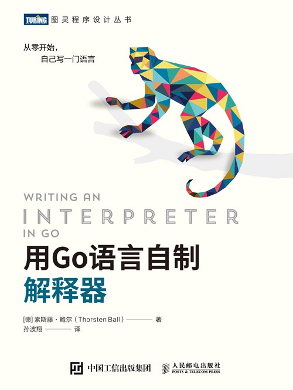

# 《用Go语言自制解释器》

## [随书代码下载](https://www.ituring.com.cn/book/2883)

## [原版随书代码](./code/%E7%94%A8Go%E8%AF%AD%E8%A8%80%E8%87%AA%E5%88%B6%E8%A7%A3%E9%87%8A%E5%99%A8-%E9%9A%8F%E4%B9%A6%E4%BB%A3%E7%A0%81.zip)是用`Go`写的，此仓库改写成`JavaScript`
---
## 目录

### [第一章](./01/)

### [第二章](./02/)

